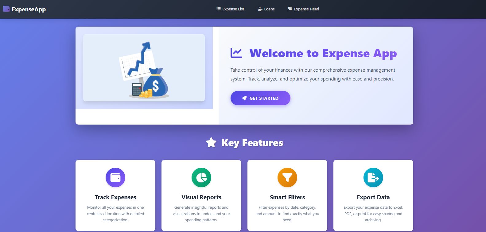
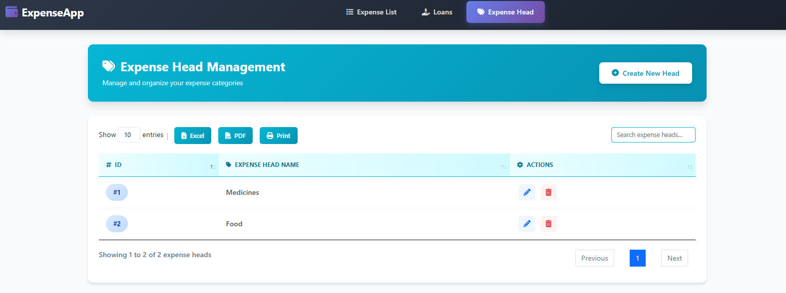
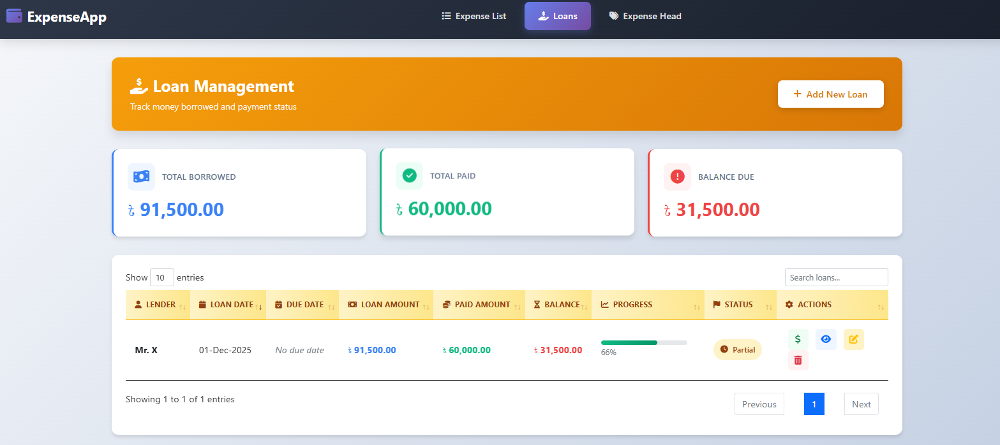

# ExpenseApp - Personal Finance Management System

  
  
  
  

  <strong>A comprehensive web-based personal finance management application built with ASP.NET Core MVC</strong>

---

## 📸 Application Screenshots

### 🏠 Home Page & Landing

  

*Welcome page with key features overview*

---

### 📊 Expense Management Dashboard

  

*Track all your expenses with smart filtering, search capabilities, and export options*

---

### 🏷️ Expense Categories

  

*Manage and organize expense categories (Medicines, Food, etc.)*

---

### 💳 Loan Management Dashboard

  

*Complete overview of all loans with payment progress, statistics, and status indicators*

---

### 📈 Loan Details & Payment Tracking

  

*Detailed payment progress with visual indicators and complete payment history*

---

## Overview
ExpenseApp is a comprehensive web-based personal finance management application built with ASP.NET Core MVC. It provides users with an intuitive platform to track daily expenses and manage borrowed funds, helping individuals maintain better control over their financial health.

## Purpose
The application addresses the common challenge of personal financial management by offering a centralized system to:
- Monitor daily spending habits across different expense categories
- Track money borrowed from lenders and repayment progress
- Gain insights into spending patterns through organized data visualization
- Maintain accurate financial records with date-based filtering and reporting

## Key Features

### Expense Management
- **Categorized Expense Tracking**: Organize expenses under customizable expense heads (categories)
- **Batch Expense Entry**: Add multiple expenses at once for efficient data entry
- **Date Range Filtering**: Search and filter expenses by date range and category
- **Export Capabilities**: Export expense data to Excel, PDF, or print formats
- **Real-time Totals**: Automatically calculate and display total expenses for selected periods

### Loan Management
- **Debt Tracking**: Record and monitor money borrowed from multiple lenders
- **Payment History**: Track all payments made against each loan with detailed notes
- **Balance Calculation**: Automatic calculation of remaining balance for each loan
- **Progress Visualization**: Visual progress bars showing repayment status
- **Due Date Reminders**: Set and track payment due dates
- **Dashboard Analytics**: Overview statistics showing total borrowed, paid, and outstanding amounts

### User Experience
- **Modern, Responsive UI**: Clean, gradient-rich design that works seamlessly on desktop and mobile devices
- **Intuitive Navigation**: Easy-to-use interface with clear action buttons and visual feedback
- **Data Tables with Search**: Interactive tables with sorting, searching, and pagination
- **Real-time Validation**: Form validation with helpful error messages
- **Toast Notifications**: User-friendly success and error notifications
- **Confirmation Dialogs**: Safety prompts before deleting important records

## Technical Stack

### Backend
- **Framework**: ASP.NET Core MVC
- **Language**: C# 
- **Database**: Entity Framework Core with SQL Server
- **Architecture**: Model-View-Controller (MVC) pattern

### Frontend
- **UI Framework**: Bootstrap 4
- **JavaScript Libraries**: jQuery, DataTables
- **Icons**: Font Awesome
- **Notifications**: Toastr.js
- **Styling**: Custom CSS with CSS Grid and Flexbox

### Database Design
- **ExpenseInfo**: Stores individual expense records with amount, date, description, and category
- **ExpenseHead**: Maintains expense categories/heads
- **Loan**: Records loan details including lender information, amounts, and dates
- **LoanPayment**: Tracks individual payments made against loans

## Target Users
- **Individuals**: People looking to manage personal expenses and track borrowed money
- **Small Business Owners**: Entrepreneurs managing business expenses and informal loans
- **Students**: College students tracking their spending and managing borrowed funds
- **Freelancers**: Self-employed professionals monitoring income and expenses

## Benefits
1. **Financial Clarity**: Clear overview of where money is going and what debts are owed
2. **Better Planning**: Historical data helps in budgeting and financial planning
3. **Accountability**: Detailed records of all financial transactions
4. **Debt Management**: Never lose track of money owed to others
5. **Time Saving**: Quick data entry and batch operations save time
6. **Accessibility**: Web-based system accessible from any device with a browser

## Use Cases

### Daily Expense Tracking
A user can quickly log their daily purchases - groceries, transportation, utilities - categorized under appropriate expense heads. At month-end, they can filter expenses to see exactly how much was spent and where.

### Loan Repayment Monitoring
When someone borrows money from multiple sources (family, friends, informal lenders), they can record each loan with the borrowed amount and due date. As payments are made, the system tracks the remaining balance and shows repayment progress visually.

### Financial Reporting
Users can generate reports for specific date ranges, export them to Excel for further analysis, or print them for record-keeping purposes.

## Future Enhancement Possibilities
- Budget setting and alerts
- Recurring expense automation
- Income tracking module
- Multi-currency support
- Mobile app version
- Data visualization charts and graphs
- Email notifications for due dates
- Multi-user support with authentication
- Receipt image attachment
- Category-wise spending analytics

## Conclusion
ExpenseApp serves as a practical, user-friendly solution for personal financial management, combining expense tracking and loan management in a single, cohesive platform. Its intuitive design and comprehensive features make it an ideal tool for anyone seeking better control over their finances.
